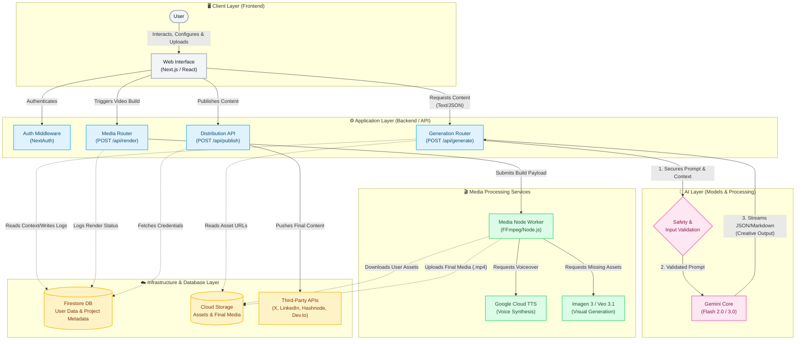

# VividLaunch — System Architecture

This outlines the high-level architecture and data flow for VividLaunch, showing how components interact across logical layers from the user interface down to the AI models and infrastructure.

## Layer Summaries

### 1. Client Layer (Frontend)
The user interface built with Next.js, React, and Tailwind/shadcn. It provides the interactive dashboards (Video, Blog, Social Studios), captures user input, and receives streamed responses from the backend.

### 2. Application Layer (Backend/API)
Serverless Next.js API routes that act as the secure intermediary. They handle authentication, payload validation, and route requests to either the AI models, the media worker, or the external distribution channels.

### 3. AI Layer
The core brain of the system safely isolated behind the API. It utilizes Google's Gemini models for reasoning, structuring storyboards (JSON), and generating long-form copy. Secure guardrails ensure prompts are clean before hitting the model.

### 4. Media Processing Layer
A dedicated Node.js service containing the FFmpeg compositing engine. It orchestrates sub-services like Google Cloud Text-to-Speech (TTS) and Imagen/Veo to assemble video scenes based on the AI's storyboard logic.

### 5. Infrastructure & Database Layer
The foundational Google Cloud services. **Firestore** handles all persistent metadata (user profiles, project briefs, generation history). **Cloud Storage** safely stores the physical files (uploaded images, generated assets, final videos). External publishing APIs sit at the edge to distribute content.
